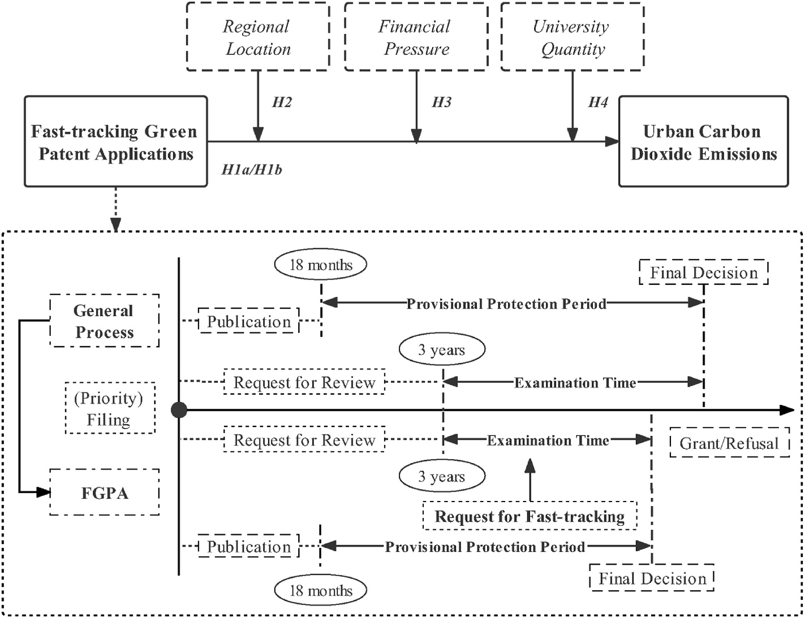

Carbon dioxide (CO2) emissions reduction has become a core task with the goal of “emission peak and carbon neutrality”, in which green innovation plays an important role. This paper takes the fast-tracking green patent applications (FGPA) system in China as a quasi-natural experiment to empirically study the impact of green innovation incentive-based policies (GIIPs) on CO2 emissions in Chinese cities by applying a continuous difference-in-difference approach. The results show that the CO2 emissions of cities in the treatment group are significantly reduced by about 1.6% after the implementation of FGPA relative to that in the control group. After a series of robustness tests, the conclusion is still valid. Furthermore, the significant negative impact on CO2 emissions is more reflected in cities located in eastern China, cities with lower financial pressure, and cities with more universities. Overall, this study fills up the gap in the empirical research on the impact of FGPA, and casts a new light on the significant environmental performance of GIIPs. The findings obtained through this study are conducive to strengthening and optimizing the implementation of FGPA, and offering policy-makers with a scientific basis of GIIPs to approach the task of reducing CO2 emissions.

Related database: Chinese Patent Database, China City Statistical Yearbook

