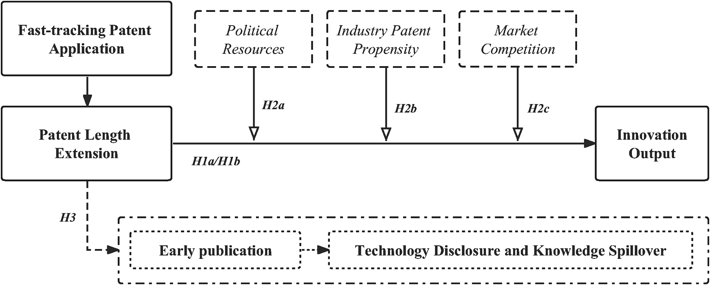

Patent length is a fundamental design of the patent system, indicating the duration of the legal monopoly granted by patents. The fast-tracking patent applications (FPA) policy is found to bring about an exogenous variation in patent length, which can be regarded as a quasi-natural experiment to study the impact of patent length extension on corporate innovation. By exploiting a difference-in-differences approach, the patent length extension brought about by FPA is found to have a significant positive impact on corporate innovation, resulting in a 30 % increase in patent applications. The effects are more reflected in firms with more political resources, firms belonging to industries with higher patent propensities, and firms facing fiercer market competition. Furthermore, the patent length extension also facilitates technology disclosure and knowledge spillover, as evidenced by a 4.8 % increase in average forward citations per patent. Overall, this study casts fresh light on patent length and fills up the gap in the empirical research on the impact of patent length extension. The findings can help optimize patent system design to achieve the dual fundamental goals of innovation incentives and technology disclosure.

